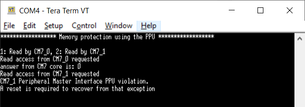

# PROT PPU Configuration
**This code example shows how to configure the PPU (Peripheral Protection Unit) and describes its operation and initial settings.**

## Device
The device used in this code example (CE) is:
- [TRAVEO™ T2G CYT4BF Series](https://www.infineon.com/cms/en/product/microcontroller/32-bit-traveo-t2g-arm-cortex-microcontroller/32-bit-traveo-t2g-arm-cortex-for-body/traveo-t2g-cyt4bf-series/)

## Board
The board used for testing is:
- TRAVEO™ T2G evaluation kit ([KIT_T2G-B-H_EVK](https://www.infineon.com/cms/en/product/evaluation-boards/kit_t2g-b-h_evk/), [KIT_T2G-B-H_LITE](https://www.infineon.com/cms/en/product/evaluation-boards/kit_t2g-b-h_lite/))

## Scope of work
In this example, the PPU is used for protection. If access violation is detected, a fault is generated.

## Introduction  
**Protection Unit**  
- An address range that is accessed by the transfer
    - Subregion: An address range is partitioned into eight equally-sized subregions and subregion can individual disables
- Access attributes such as:
    - Read/write attribute
    - Execute attribute to distinguish a code access from a data access
    - User/privilege attribute to distinguish access; for example, OS/kernel access from a task/thread access
    - Secure/non-secure attribute to distinguish a secure access from a non-secure access; the Arm Cortex-M CPUs do not
natively support this attribute
    - A protection context attribute to distinguish accesses from different protection contexts; for Peripheral-DMA (P-DMA) and Memory-DMA (M-DMA), this attribute is extended with a channel identifier, to distinguish accesses from different channels
- Memory protection
- Provided by memory protection units (MPUs) and shared memory protection units (SMPUs)
    - MPUs distinguish user and privileged accesses from a single bus master
    - SMPUs distinguish between different protection contexts and between secure and non-secure accesses
- Peripheral protection
    - Provided by peripheral protection units (PPUs)
    - The PPUs distinguish between different protection contexts; they also distinguish secure from non-secure accesses and user mode accesses from privileged mode accesses
- Protection pair structure
- Software Protection Unit (SWPU): SWPUs define flash write (or erase) permissions, and eFuse read and write permissions. An SWPU comprises of the following:
    - Flash Write Protection Unit (FWPU)
    - eFuse Read Protection Unit (ERPU)
    - eFuse Write Protection Unit (EWPU)

More details can be found in [Technical Reference Manual (TRM)](https://www.infineon.com/dgdl/?fileId=5546d4627600a6bc017600bfae720007), [Registers TRM](https://www.infineon.com/dgdl/?fileId=5546d4627600a6bc017600be2aef0004) and [Data Sheet](https://www.infineon.com/dgdl/?fileId=5546d46275b79adb0175dc8387f93228).

## Hardware setup
This CE has been developed for:
- TRAVEO™ T2G evaluation kit ([KIT_T2G-B-H_EVK](https://www.infineon.com/cms/en/product/evaluation-boards/kit_t2g-b-h_evk/)) 
 
No changes are required from the board's default settings.

- TRAVEO™ T2G Body High Lite evaluation kit ([KIT_T2G-B-H_LITE](https://www.infineon.com/cms/en/product/evaluation-boards/kit_t2g-b-h_lite/)) 
 
No changes are required from the board's default settings.

## Implementation
This design consists of a shared memory region for processor communication and uses the CM0+, the CM7_0 and the CM7_1 core. The PPU and UART communication is configured in the CM0+ core. Access to the PPU protected peripheral is done using the CM7_0 and CM7_1 core. CM7_0 can read the value of the memory, CM7_1 has no access given, causing the system to generate a fault, which requires a reset to recover from.

**STDIN / STDOUT setting**

Initialization of the GPIO for UART is done in the <a href="https://infineon.github.io/retarget-io/html/group__group__board__libs.html#gaddff65f18135a8491811ee3886e69707"><i>cy_retarget_io_init()</i></a> function.
- Initialize the pin specified by CYBSP_DEBUG_UART_TX as UART TX, the pin specified by CYBSP_DEBUG_UART_RX as UART RX (these pins are connected to KitProg3 COM port)
- The serial port parameters are set to 8N1 and 115200 baud

<a href="https://infineon.github.io/mtb-hal-cat1/html/group__group__hal__uart.html#ga89108b2d339dc9863ec660588e3a4a12"><i>cyhal_uart_getc()</i></a> returns the user input from the terminal as received data.

**Shared memory region**

A shared SRAM memory region is defined in the linker file (*linker.ld*) of both core types. The region has the same address for all cores, which makes content stored in it accessible by these cores. The region is specified to be an address range of 0x100 and is dynamically placed after the private memory placeholder by using variables. In this example, the shared memory is evaluated to be at address 0x28000800.

**Bus master configuration**

In this example, two different protection context (PC) are used:

- PC5: Read and write access is not allowed for user and privileged
- PC6: Read and write access is allowed for user and privileged

CM7_0 is configured to be in protection context 6 and CM7_1 is configured to be in protection content 5.
Bus masters are configured, using the <a href="https://infineon.github.io/mtb-pdl-cat1/pdl_api_reference_manual/html/group__group__prot__functions__busmaster.html#ga2d3a54039578a9fae98f6c7b4c4cff41"><i>Cy_Prot_SetActivePC()</i></a> function.

**Peripheral protection**

A GPIO port is protected by the PPU. This is done by using the <a href="https://infineon.github.io/mtb-pdl-cat1/pdl_api_reference_manual/html/group__group__prot__functions__ppu__fixed__v2.html#ga6112f6eba93e5db763e8dc571a91740a"><i>Cy_Prot_ConfigPpuFixedSlaveAtt()</i></a> function.

**Enabling CM7s**

After that, CM0+ enable both CM7_0/1 cores, using the <a href="https://infineon.github.io/mtb-pdl-cat1/pdl_api_reference_manual/html/group__group__system__config__cm7__functions.html#gacac741f6dd29eb66dc7e4fb31eef52fe"><i>Cy_SysEnableCM7()</i></a> function.

**Core communication**

To allow communication between different cores, a variable is defined and periodically checked by all cores. Depending on an ENUM value, placed by CM0+ and based on user input, the CM7_0 and CM7_1 core act and try to return the content from the specified memory address by using the shared memory.

**Read access to GPIO register**

Both CM7 cores try accessing protected region, using <a href="https://infineon.github.io/mtb-pdl-cat1/pdl_api_reference_manual/html/group__group__gpio__functions__gpio.html#ga4fa0bdf7c0dc3e734e4f76a093f9fd02"><i>Cy_GPIO_Read()</i></a> function.

**Detection of access violation**

A bus master access to a peripheral protected by the PPU, will be evaluated by the bus master's protection context. If the PC matches the requested access, it will be allowed, if not, the PPU prevents the access and raises a pending fault.
Pending faults are checked by the CM0+ core by calling <a href="https://infineon.github.io/mtb-pdl-cat1/pdl_api_reference_manual/html/group__group__sysfault__functions.html#ga3da70af9e3a434ac08d9d5d63a09c480"><i>Cy_SysFault_GetPendingFault()</i></a> and prohibit further functioning of this example.

## Run and Test
For this example, a terminal emulator is required to display outputs and receive keys pressed. You can install a terminal emulator if you do not have one. In this example, [Tera Term](https://ttssh2.osdn.jp/index.html.en) was used as the terminal emulator.

After code compilation, perform the following steps to flashing the device:
1. Connect the board to your PC using the provided USB cable through the KitProg3 USB connector.
2. Open a terminal program and select the KitProg3 COM port. Set the serial port parameters to 8N1 and 115200 baud.
3. Program the board using one of the following:
    - Select the code example project in the Project Explorer.
    - In the **Quick Panel**, scroll down, and click **[Project Name] Program (KitProg3_MiniProg4)**.
4. After programming, the code example starts automatically. Confirm that the messages are displayed on the UART terminal.

    - *Terminal output on program startup* 
5. After reading first from core CM7_0 and afterwards from core CM7_1, the memory values are displayed. A reset is required as CM7_1 is not allowed to access the address specified.
    - *Terminal output after CM7_0 and CM7_1 read* 
6. You can debug the example to step through the code. In the IDE, use the **[Project Name] Debug (KitProg3_MiniProg4)** configuration in the **Quick Panel**. For details, see the "Program and debug" section in the [Eclipse IDE for ModusToolbox™ software user guide](https://www.infineon.com/dgdl/?fileId=8ac78c8c8386267f0183a8d7043b58ee).

**Note:** **(Only while debugging)** On the CM7 CPU, some code in *main()* may execute before the debugger halts at the beginning of *main()*. This means that some code executes twice: once before the debugger stops execution, and again after the debugger resets the program counter to the beginning of *main()*. See [KBA231071](https://community.infineon.com/t5/Knowledge-Base-Articles/PSoC-6-MCU-Code-in-main-executes-before-the-debugger-halts-at-the-first-line-of/ta-p/253856) to learn about this and for the workaround.

## References  
Relevant Application notes are:
- AN235305 - GETTING STARTED WITH TRAVEO™ T2G FAMILY MCUS IN MODUSTOOLBOX™
- [AN219843](https://www.infineon.com/dgdl/?fileId=8ac78c8c7cdc391c017d0d3abf4b6772) - Protection configuration in TRAVEO™ T2G MCU

ModusToolbox™ is available online:
- <https://www.infineon.com/modustoolbox>

Associated TRAVEO™ T2G MCUs can be found on:
- <https://www.infineon.com/cms/en/product/microcontroller/32-bit-traveo-t2g-arm-cortex-microcontroller/>

More code examples can be found on the GIT repository:
- [TRAVEO™ T2G Code examples](https://github.com/orgs/Infineon/repositories?q=mtb-t2g-&type=all&language=&sort=)

For additional trainings, visit our webpage:  
- [TRAVEO™ T2G trainings](https://www.infineon.com/cms/en/product/microcontroller/32-bit-traveo-t2g-arm-cortex-microcontroller/32-bit-traveo-t2g-arm-cortex-for-body/traveo-t2g-cyt4bf-series/#!trainings)

For questions and support, use the TRAVEO™ T2G Forum:  
- <https://community.infineon.com/t5/TRAVEO-T2G/bd-p/TraveoII>  